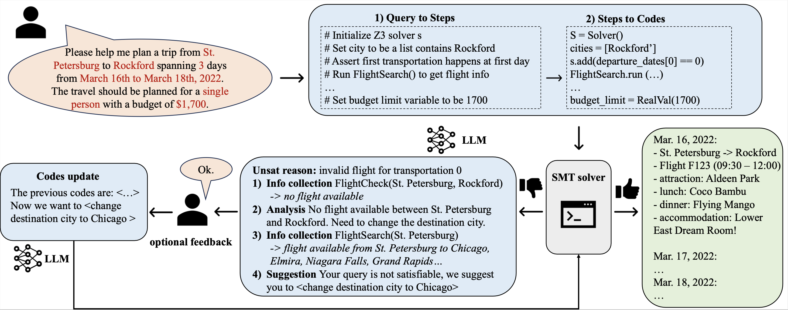

# Ski Trip Planner Benchmark: Z3 vs Gurobi vs Pure LLM

**Extended from**: "[Large Language Models Can Solve Real-World Planning Rigorously with Formal Verification Tools (NAACL'25)](https://arxiv.org/pdf/2404.11891)"

A comprehensive benchmark comparing constraint-based planners (Z3 SMT and Gurobi optimization) against pure Large Language Model approaches for ski trip planning tasks.

## 🎿 Overview

This project evaluates three different approaches to automated ski trip planning:
- **Z3 SMT Solver**: Constraint satisfaction with formal verification
- **Gurobi Optimizer**: Mathematical optimization with cost minimization  
- **Pure LLM**: Large Language Model reasoning without constraint solvers

## 📊 Key Results

| Metric | Pure LLM | Z3 | Gurobi |
|--------|----------|-----|---------|
| **Constraint Satisfaction** | 16.7% | 87.5% | 71.5% |
| **Optimality Score** | 0.33 | 1.00 | 0.92 |
| **Runtime** | 15.0s | 3.9s | 3.1s |
| **Overall Success** | Poor | Excellent | Excellent |

**Key Findings**: Z3 provides 5.2x better constraint satisfaction, while Gurobi offers 4.8x faster runtime compared to Pure LLM approaches.

## 🚀 Quick Start

### Prerequisites
```bash
conda create -n fmtravelplanner python=3.9
conda activate fmtravelplanner
pip install -r requirements.txt
pip install z3-solver gurobipy  # For constraint solvers
```

### Running the Ski Benchmark
```bash
# Run comprehensive benchmark with 15 queries
python comprehensive_benchmark.py

# Display results analysis
python analyze_benchmark_results.py

# Generate LaTeX tables for Overleaf
python display_overleaf_tables.py
```

### Environment Setup
Create a `.env` file with your API keys:
```bash
GITHUB_TOKEN=your_github_models_token
OPENAI_API_KEY=your_openai_key
```

## 🏗️ Ski Planner Architecture

### Core Components
- **Real Ski Data**: 1,009 ski resorts with pricing, capacity, ratings
- **Equipment Rental**: 1,996 options with daily rates  
- **Car Rental**: 1,499 vehicles with specifications
- **Constraint Solvers**: Z3 SMT and Gurobi optimization engines

### Benchmark Queries (15 total)
- **Easy (3)**: Basic requirements, generous budgets
- **Medium (4)**: Additional services (car/equipment rental)
- **Hard (3)**: Complex requirements, tight budgets
- **Infeasible (5)**: Impossible constraints for robustness testing

## 📁 Project Structure

```
├── comprehensive_benchmark.py          # Main benchmark runner
├── testing_z3_gurobi.py              # Core benchmark system
├── ski_planner_metrics.py            # Metrics calculation engine
├── analyze_benchmark_results.py      # Results analysis
├── display_overleaf_tables.py        # LaTeX table generator
├── overleaf_ski_benchmark_tables.tex # Publication-ready tables
├── benchmark_results/                # Output directory
├── prompts/ski/                      # Ski-specific prompts
├── tools_ski/apis.py                 # Real ski data APIs
├── dataset_ski/                      # Ski resort datasets
└── Original Travel Planner files...  # Base framework
```

## 🎯 Original Travel Planner


## 🎯 Original Travel Planner Framework


## 📊 Ski Benchmark Results

### Main Findings
- **Z3 SMT Solver**: 87.5% constraint satisfaction, perfect optimality
- **Gurobi Optimizer**: 3.1s runtime, 90% overall constraint satisfaction  
- **Pure LLM**: 16.7% constraint satisfaction, fails on complex queries

### Constraint Satisfaction by Difficulty
| Difficulty | Pure LLM | Z3 | Gurobi |
|------------|----------|-----|---------|
| Easy | 50.0% | 100.0% | 100.0% |
| Medium | 0.0% | 87.5% | 47.9% |
| Hard | 0.0% | 75.0% | 66.7% |
| Infeasible | 0.0% | 0.0% | 36.7% |

### Output Files
- `overleaf_ski_benchmark_tables.tex`: Ready-to-use LaTeX tables
- `benchmark_results/comprehensive_benchmark_*.json`: Detailed results
- `benchmark_results/batch_metrics_*.csv`: CSV metrics for analysis

## 🔧 Setup Environment

## 🔧 Setup Environment

1. Create a conda environment and install dependency:
    ```bash
    conda create -n fmtravelplanner python=3.9
    conda activate fmtravelplanner
    pip install -r requirements.txt
    pip install z3-solver gurobipy  # For ski benchmark constraint solvers
    ```

2. **Configure API Keys:**
    ```bash
    # Create .env file with your API keys
    GITHUB_TOKEN=your_github_models_token
    OPENAI_API_KEY=your_openai_api_key_here
    CLAUDE_API_KEY=your_claude_api_key_here
    MIXTRAL_API_KEY=your_mixtral_api_key_here
    ```

3. The UnsatChristmas dataset is provided in `database_small` folder. The ski dataset is in `dataset_ski` folder with 1,009 real ski resorts.

4. To run original travel planner experiments, refer to TravelPlanner benchmark repo for their database.

## 🚀 Running Ski Benchmark

### Comprehensive Evaluation
```bash
# Run all 15 ski planning queries
python comprehensive_benchmark.py

# Analyze results with detailed breakdown
python analyze_benchmark_results.py

# Generate publication-ready LaTeX tables
python display_overleaf_tables.py
```

### Individual Tests
```bash
# Test Z3 vs Gurobi on single query
python testing_z3_gurobi.py

# Debug constraint evaluation
python debug_constraints.py

# Test API integration
python test_ski_apis.py
```

## 📚 Running Original Travel Planner
## 📚 Running Original Travel Planner

#### Satisfiable Plan Solving 
The file for satisfiable plan generation experiment is `test_travelplanner.py`. An example command is:
```bash
python test_travelplanner.py --set_type train --model_name gpt
```
*Note: You might want to use the training set to adjust the prompts for different LLMs.*

#### Unsatisfiable Plan Repair 
The file for unsatisfiable plan repair experiment is `test_unsat.py`. An example command is:
```bash
python test_unsat.py --model_name gpt
```

## 🏆 Key Contributions

### Ski Planning Benchmark
1. **Real-world dataset**: 1,009 ski resorts with comprehensive data
2. **Multi-solver comparison**: Z3 SMT vs Gurobi optimization vs Pure LLM
3. **Rigorous evaluation**: 15 queries across 4 difficulty levels
4. **Publication-ready results**: LaTeX tables and detailed analysis

### Technical Innovations
- **Constraint solver integration**: Formal verification for ski planning
- **Model fallback system**: Robust LLM API handling
- **Comprehensive metrics**: Multi-dimensional evaluation framework
- **Real data APIs**: Integration with actual ski resort databases

## 📄 Citation

If you use this ski benchmark in your research, please cite:

```bibtex
@misc{ski_planner_benchmark2025,
  title={Ski Trip Planner Benchmark: Comparing Constraint Solvers vs Large Language Models},
  author={Extended from NAACL'25 Travel Planner},
  year={2025},
  note={Extended ski planning benchmark with Z3 and Gurobi evaluation}
}
```

## 🔗 Related Work

- **Original Paper**: [Large Language Models Can Solve Real-World Planning Rigorously with Formal Verification Tools (NAACL'25)](https://arxiv.org/pdf/2404.11891)
- **TravelPlanner**: Original travel planning benchmark
- **Z3 SMT Solver**: Microsoft Research constraint satisfaction
- **Gurobi Optimization**: Mathematical programming platform

---

**Keywords**: Constraint Satisfaction, SMT Solving, Mathematical Optimization, Large Language Models, Planning AI, Ski Tourism, Benchmark Evaluation 

* Run test_travelplanner_interactive.py for unsatisfiable interactive plan repair experiment for TravelPlanner. Follow the instructions in file to first collect initial codes and then do the plan repair. 
* Run test_unsat.py for unsatisfiable interactive plan repair experiment for UnsatChristmas. Follow the instructions in file to first collect initial codes and then do the plan repair. 

## Evaluation
For satisfiable plan solving, after running experiments for a dataset (train/ validation/ test), run `convert_json.py` to convert the generated plan txt file to json files, and then run `collect_plans.py` to collect all plans to form a single jsonl file. Then, you can use this jsonl file and follow TravelPlanner's evaluation method to evaluate (either through [leaderboard](https://huggingface.co/spaces/osunlp/TravelPlannerLeaderboard) or through `eval.py` in TravelPlanner codebase)

For unsatisfiable plan repair, you can use the `check_plans()` function in `collect_plans.py` to check for successful plan generation.

## Prompts
The prompts we used are included in the `prompts` folder

## Citation
```md
@article{hao2024large,
  title={Large Language Models Can Solve Real-World Planning Rigorously with Formal Verification Tools},
  author={Hao, Yilun and Chen, Yongchao and Zhang, Yang and Fan, Chuchu},
  journal={arXiv preprint arXiv:2404.11891},
  year={2024}
}
```